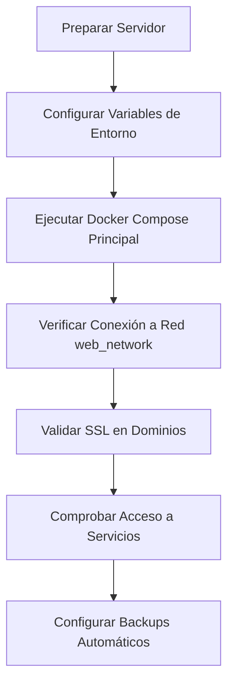
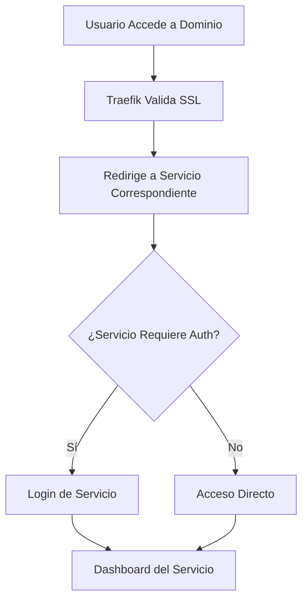

## 1. Descripción General del Producto

Sistema unificado de despliegue para Flowise AI y n8n que utiliza Traefik como proxy inverso, permitiendo la gestión centralizada de múltiples servicios de automatización y flujos de trabajo con SSL automático y enrutamiento basado en dominios.

**Objetivo**: Simplificar el despliegue y mantenimiento de servicios de automatización empresarial con alta disponibilidad y seguridad SSL/TLS.

**Usuarios objetivo**: Desarrolladores, administradores de sistemas, equipos de automatización empresarial.

## 2. Funcionalidades Principales

### 2.1 Roles de Usuario
| Rol | Método de Acceso | Permisos Principales |
|-----|------------------|----------------------|
| Administrador del Sistema | Credenciales SSH/Terminal | Configurar servicios, gestionar SSL, monitorear estado |
| Usuario Flowise | Login web flowise.alpacapurpura.lat | Crear/editar flujos de IA, gestionar APIs |
| Usuario n8n | Login web n8n.alpacapurpura.lat | Crear/editar automatizaciones, gestionar workflows |

### 2.2 Módulos de Funcionalidad

El sistema de despliegue unificado incluye las siguientes páginas/servicios principales:

1. **Panel de Control Flowise**: Interfaz web para diseño de flujos de IA
2. **Panel de Control n8n**: Interfaz web para automatización de workflows
3. **Dashboard Traefik**: Panel de administración de rutas y servicios (opcional)
4. **Sistema de Monitoreo**: Visualización del estado de servicios

### 2.3 Detalles de Servicios

| Servicio | Módulo Principal | Descripción de Funcionalidad |
|----------|------------------|-------------------------------|
| Flowise | Gestión de Flujos | Crear, editar y ejecutar flujos de trabajo de IA con integración de APIs |
| Flowise | Configuración de APIs | Gestionar claves API y configuraciones de servicios externos |
| n8n | Editor de Workflows | Interfaz drag-and-drop para crear automatizaciones complejas |
| n8n | Gestión de Credenciales | Almacenar y gestionar credenciales de servicios externos de forma segura |
| n8n | Ejecución de Triggers | Ejecutar automatizaciones basadas en eventos o tiempo programado |
| Sistema | SSL/TLS Automático | Generar y renovar certificados SSL automáticamente vía Let's Encrypt |
| Sistema | Enrutamiento Inteligente | Dirigir tráfico basado en dominios con Traefik |

## 3. Flujo de Operaciones

### Flujo de Despliegue Principal

### Flujo de Usuario Final

## 4. Diseño de Interfaz

### 4.1 Estilo de Diseño
- **Colores primarios**: Azul (#2563eb) para elementos principales
- **Colores secundarios**: Gris (#6b7280) para textos y bordes
- **Estilo de botones**: Redondeados con sombras sutiles
- **Tipografía**: Inter o system fonts para mejor legibilidad
- **Diseño general**: Minimalista con énfasis en funcionalidad

### 4.2 Diseño por Servicio

| Servicio | Elementos UI | Especificaciones |
|----------|--------------|------------------|
| Flowise | Canvas de Flujos | Área central drag-and-drop con panel lateral de nodos |
| Flowise | Barra de Herramientas | Botones redondeados para guardar, ejecutar y configurar |
| n8n | Editor de Nodos | Interfaz tipo flowchart con conectores visuales |
| n8n | Panel de Ejecución | Vista de logs y estado de ejecuciones en tiempo real |

### 4.3 Responsividad
- **Primario**: Diseño desktop-first para uso profesional
- **Adaptativo**: Interfaces se adaptan a tablets y móviles
- **Optimización**: Touch-friendly para dispositivos táctiles

## 5. Requisitos Técnicos

### 5.1 Requisitos Previos
- Docker Engine 20.10+
- Docker Compose 2.0+
- Traefik 2.9+ ya desplegado con red web_network
- Dominios DNS configurados (flowise.alpacapurpura.lat, n8n.alpacapurpura.lat)
- Puerto 80 y 443 disponibles

### 5.2 Requisitos de Hardware
- **CPU**: Mínimo 2 cores (4+ recomendado)
- **RAM**: Mínimo 4GB (8GB+ recomendado)
- **Almacenamiento**: 20GB+ para datos y logs
- **Red**: Conexión estable a internet para SSL

### 5.3 Requisitos de Software
- Sistema operativo Linux (Ubuntu 20.04+ recomendado)
- Docker y Docker Compose instalados
- Traefik pre-configurado con red web_network
- Certbot o Let's Encrypt para SSL

## 6. Seguridad

### 6.1 Autenticación
- Autenticación básica para acceso a servicios
- JWT para gestión de sesiones en n8n
- Encriptación de credenciales en ambos servicios

### 6.2 Seguridad de Red
- SSL/TLS obligatorio para todos los dominios
- Red interna separada para servicios de backend
- Firewall configurado para permitir solo puertos necesarios

### 6.3 Gestión de Secretos
- Variables de entorno para credenciales
- Volúmenes Docker para datos sensibles
- Backup encriptado de configuraciones críticas