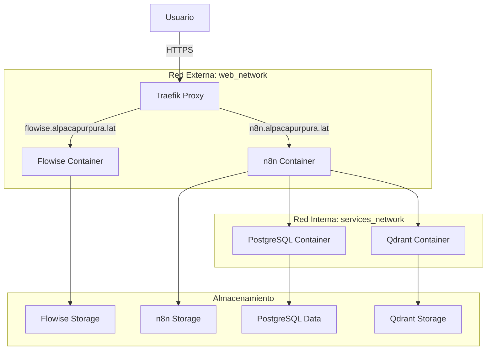

# Arquitectura Técnica: Flowise y n8n con Traefik Proxy

## 1. Arquitectura del Sistema



## 2. Descripción de Tecnologías

- **Frontend**: No aplica (servicios web autónomos)
- **Proxy Inverso**: Traefik (ya desplegado en el servidor)
- **Servicios**: Flowise AI, n8n (automatización)
- **Base de Datos**: PostgreSQL 16 (para n8n)
- **Vector Database**: Qdrant (para n8n)
- **Contenedorización**: Docker & Docker Compose
- **Red**: web_network (externa), services_network (interna)

## 3. Estructura de Carpetas Propuesta

```
/home/chris/IA-NC/
├── traefik-unified/
│   ├── docker-compose.yml          # Orquestador principal
│   ├── .env                        # Variables globales
│   ├── flowise/
│   │   ├── docker-compose.yml      # Configuración específica de Flowise
│   │   ├── .env                    # Variables de Flowise
│   │   └── data/                   # Datos persistentes de Flowise
│   ├── n8n/
│   │   ├── docker-compose.yml      # Configuración específica de n8n
│   │   ├── .env                    # Variables de n8n
│   │   ├── data/                   # Datos persistentes de n8n
│   │   ├── backup/                 # Backups de n8n
│   │   └── logs/                   # Logs de n8n
│   └── shared/                     # Recursos compartidos
└── README.md                       # Documentación de despliegue
```

## 4. Configuración de Red

### Red Externa (web_network)
- **Propósito**: Comunicación con Traefik
- **Tipo**: Externa (ya existe en el servidor)
- **Servicios conectados**: Flowise, n8n

### Red Interna (services_network)
- **Propósito**: Comunicación entre servicios internos
- **Tipo**: Interna (crear automáticamente)
- **Servicios conectados**: n8n, PostgreSQL, Qdrant

## 5. Configuración de Servicios

### 5.1 Flowise Configuration
```yaml
# Configuración esencial heredada del sistema actual
PORT: 3000
DATABASE_PATH: /root/.flowise
APIKEY_PATH: /root/.flowise
SECRETKEY_OVERWRITE: [clave_generada]
FLOWISE_USERNAME: [usuario_configurado]
FLOWISE_PASSWORD: [contraseña_segura]
DEBUG: false
EXECUTION_MODE: main
```

### 5.2 n8n Configuration
```yaml
# Configuración esencial heredada del sistema actual
DB_TYPE: postgresdb
DB_POSTGRESDB_HOST: postgres
DB_POSTGRESDB_USER: n8n
DB_POSTGRESDB_PASSWORD: [contraseña_postgres]
N8N_ENCRYPTION_KEY: [clave_encriptacion_larga]
N8N_USER_MANAGEMENT_JWT_SECRET: [jwt_secret_largo]
N8N_HOST: https://n8n.alpacapurpura.lat
WEBHOOK_URL: https://n8n.alpacapurpura.lat/
```

## 6. Variables de Entorno Globales

| Variable | Descripción | Ejemplo |
|----------|-------------|---------|
| TRAEFIK_NETWORK | Red externa de Traefik | web_network |
| FLOWISE_DOMAIN | Dominio de Flowise | flowise.alpacapurpura.lat |
| N8N_DOMAIN | Dominio de n8n | n8n.alpacapurpura.lat |
| LETSENCRYPT_EMAIL | Email para SSL | alpacapurpura@gmail.com |

## 7. Seguridad y SSL/TLS

- **Certificados**: Gestión automática mediante Traefik + Let's Encrypt
- **Redirección**: HTTP -> HTTPS automática
- **Headers**: Configuración de seguridad mediante Traefik labels
- **Autenticación**: Mantener credenciales de acceso de cada servicio

## 8. Almacenamiento Persistente

| Servicio | Volumen Docker | Ruta Local |
|----------|----------------|------------|
| Flowise | flowise_data | ./flowise/data |
| n8n | n8n_data | ./n8n/data |
| PostgreSQL | postgres_data | ./n8n/postgres_data |
| Qdrant | qdrant_data | ./n8n/qdrant_data |

## 9. Monitoreo y Logging

- **Logs**: Centralización mediante Docker logs
- **Health Checks**: Configuración para cada servicio
- **Backup**: Scripts de respaldo para datos críticos
- **Monitoreo**: Integración con Traefik dashboard

## 10. Consideraciones de Rendimiento

- **Recursos**: Definir límites de CPU y memoria
- **Escalabilidad**: Preparar para múltiples instancias si es necesario
- **Optimización**: Configuración de caché y conexiones
- **Balanceo**: Traefik maneja el balanceo de carga automáticamente